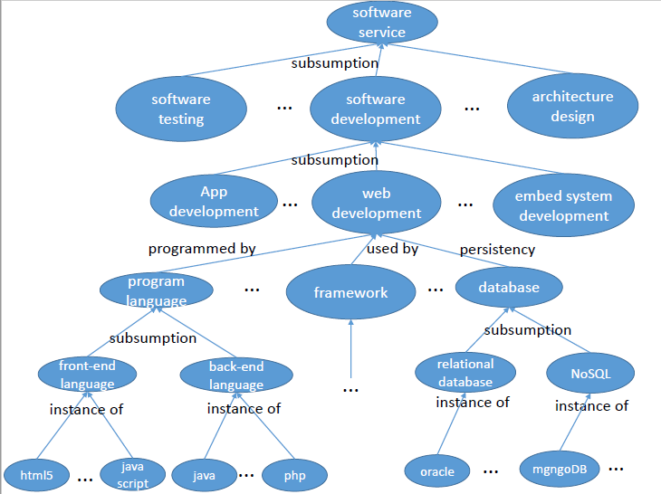

# SSKB (Software Service Knowledge Base)

The main data sources of SSKB includes the knowledge collected from software crowdsourcing experts, StackOverflow tag synonym system (http://stackoverflow.com/tags/synonyms) and Wikipedia (https://www.wikipedia.org).

The following figure shows a fragment of our SSKB.

